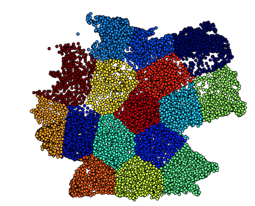

**Bring your fictive German city name and get latitude and longitude of it.**


# Intention

With this project I had 2 intensions:
* Find relations in names of German locations, founding date and the cultures / nations there. For instance I tried to find differences in the naming of locations in the south of the German republic where the former 3 states _Großherzogtum Baden_, _Königreich Württemberg_ and _Königreich Bayern_ were located. After various clusterings of different parts of the data and predictions, I definitely found clusters there.
* Back in the days, I was also interested in establishing a small web site, where you can create your village / city / town at a place given by DreamCity. Something like social networks with virtual locations and place for your self realization.

Anyway, now I don't have the time to a) complete the research here and b) deploy the small funny game. So, the time was right to publish some parts of this work.


# How it works
Data from 12.240 largest German cities / towns / locations were used. These locations were annotated with latitude and longitude.
Below I listed the steps from data to model:
1. Location name was divied into n-grams (where n = 3) [1]
2. Each distinct n-gram (e.g. 'Ber' in Berlin) occupies a dimension in the feature vector (dictionary approach)
3. The feature vector has a size of 5810 dimensions (distinct 3-grams of 12k locations)
4. Each location is then represented with a 5810 dimensional vector containing {0,1}s like (0,0,0,0,0,1,....,0,1,0,0)
5. The regressor learns to map this 5810 dimensional vector to the corresponding (lat,lng) pair of the location
6. The regressor was configured like this: 100 hidden neurons, adam solver[2], adaptive learning rate, 900k iterations with logistic activation function [3]

After the training the results are:

For a sum of 67145.162 kilometers drift (deviation from the correct (lat, lng) pair) over 12237 samples the regressor achieves a **mean error per location of: 5.49 kilometers.**


# Play around
If you want to play around with this code, the following notes could be interesting for you.

### Execute dream city regressor
Just start the following script followed by the city name you want from regressor.
```python
> python start_regressor.py Müllerstadt
Müllerstadt
lat: 50.4615841198 lng: 8.53205433763
>_
```

### Evaluate the regressor on your own
For this the script below can be used on the current regressor using the current n-gram model as feature transformator.

```python
> python eval_regressor.py
sum of all drifts = 67145.1620699
number of samples = 12237
mean drift kilometers = 5.48706072321 km
>_
```
### Train a new regressor
This is also possible. The data set for the training can be found in _data/locations.csv_. If you want to retrain just with other configurations, change them in _train_regressor.py_ and just re-run it. You can also exchange the data set with your locations and start the training again.

```python
> python train_regressor.py
>_
```


# What else
If you have any ideas or improvements let me know. For further questions on this publication just drop me a message on twitter @AlexanderBresk.

* More at http://www.cip-labs.net.
* Personal page: http://alexander.bre.sk

# References
[1] Neuron food on n-grams (https://en.wikipedia.org/wiki/N-gram)

[2] Diederik P. Kingma, Jimmy Ba. Adam: A Method for Stochastic Optimization (https://arxiv.org/abs/1412.6980)

[3] What is the role of activation function in neural nets? (https://www.quora.com/What-is-the-role-of-the-activation-function-in-a-neural-network)
